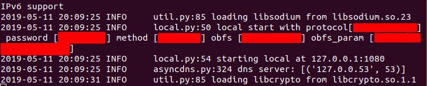
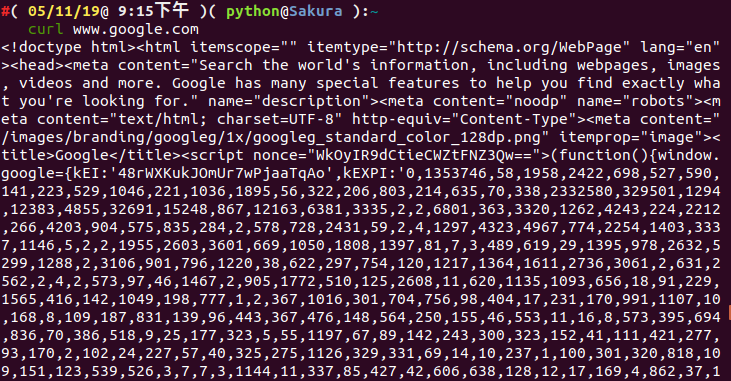
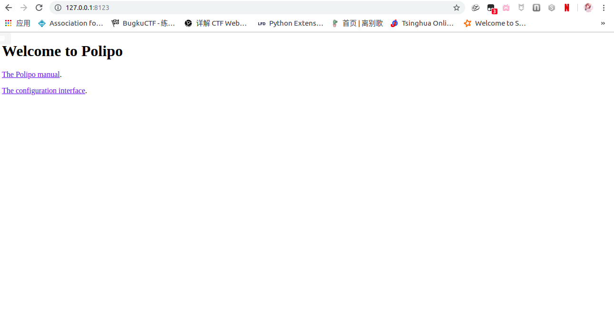
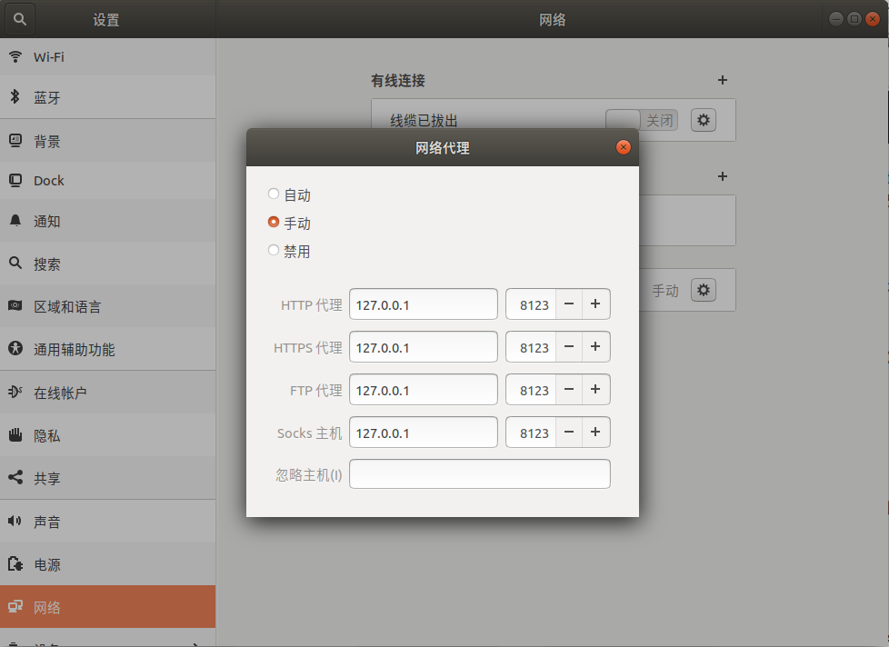

## Ubuntu 18.04  自动化搭建 ShadowsocksR 的终极方案

上一次我写过一篇文章为《[基于阿里云学生机(Centos7)搭建 SSR 代理](https://www.cnblogs.com/ECJTUACM-873284962/p/10359465.html)》，里面讲述了如何在服务器上搭建并部署 `SSR` 节点，以及如何在本地通过 GUI 客户端去连接到服务器端，构建本地的一个 `Socks5` 代理。无奈如果是碰到 `GUI` 客户端用不了的情况下，我们又该如何去构建 `Socks5` 代理去连接到服务器端呢，这将会是我们今天要讨论的话题。我会一步一步带大家一起来写一个自动化脚本来完成这一配置过程。

### 1、下载 `SSR` 客户端

```shell
sudo apt install git
git clone git@github.com:ssrarchive/shadowsocksr.git
```

### 2、配置 `ss` 文件

文件被clone下来以后，当前目录下会有一个 `shadowsocksr` 的文件夹，进入 `shadowsocksr` 文件夹，里面有一个文件叫 `config.json` ，这是配置文件的模板，里面就是我们需要设置的代理参数，复制一份到 `/etc/shadowsocks.json`。

```shell
cd shadowsocksr
sudo cp config.json /etc/shadowsocks.json
```

然后我们对这个文件进行配置：

```shell
sudo apt install vim
sudo vim /etc/shadowsocks.json
```

打开文件之后，我们看到的具体内容就包含了我们需要配置代理的详细参数，具体情况如下图所示：

```shell
{
    "server": "0.0.0.0",
    "server_ipv6": "::",
    "server_port": 8388,
    "local_address": "127.0.0.1",
    "local_port": 1080,

    "password": "m",
    "method": "aes-128-ctr",
    "protocol": "auth_aes128_md5",
    "protocol_param": "",
    "obfs": "tls1.2_ticket_auth_compatible",
    "obfs_param": "",
    "speed_limit_per_con": 0,
    "speed_limit_per_user": 0,

    "additional_ports" : {}, // only works under multi-user mode
    "additional_ports_only" : false, // only works under multi-user mode
    "timeout": 120,
    "udp_timeout": 60,
    "dns_ipv6": false,
    "connect_verbose_info": 0,
    "redirect": "",
    "fast_open": false
}
```

主要用到的配置是下面几个选项，但是具体配置哪些参数还得看 `SS` 供应商给的参数情况，尽量多填，但是要保证正确，如果有错的话代理是不能通过的：

```shell
"server": "0.0.0.0",		                #  服务器ip地址
"server_port": 8388,	                    #  服务器端口
"password": "m",			                #  服务器密码
"method": "aes-128-ctr",	                #  加密方式
"protocol": "auth_aes128_md5",		        #  协议
"protocol_param": "",					    #  协议参数
"obfs": "tls1.2_ticket_auth_compatible",	#  混淆
"obfs_param": "",						    #  混淆参数
```

### 3、启动 `SSR` 客户端：

```shell
python3 ../shadowsocksr/shadowsocks/local.py -c /etc/shadowsocks.json
```

如果没有安装 `python3` 的朋友可以通过以下命令进行安装：

```shell
sudo apt install -y python3-pip
```

成功运行界面如下：



### 4、转换为 `http` 代理

由于 `shadowsocks` 默认是用 `socks5` 协议的，对于终端的 `get`、`wget` 等用的是 `http` 协议，所以我们需要转换成 `http` 代理，加强通用性，这里使用的转换方法是基于 `polipo` 的。

我们可以修改其配置文件信息：

```shell
sudo apt install polipo
sudo vim /etc/polipo/config
```

按照下面的内容进行修改和替换，然后保存即可。

```shell
# This file only needs to list configuration variables that deviate
# from the default values. See /usr/share/doc/polipo/examples/config.sample
# and "polipo -v" for variables you can tweak and further information.
logSyslog = false
logFile = "/var/log/polipo/polipo.log"

socksParentProxy = "127.0.0.1:1080"
socksProxyType = socks5

chunkHighMark = 50331648
objectHighMark = 16384

serverMaxSlots = 64
serverSlots = 16
serverSlots1 = 32

proxyAddress = "0.0.0.0"
proxyPort = 8123
```

我们再尝试重启 `polipo` ：

```shell
/etc/init.d/polipo restart
```

验证代理是否正常工作：

```shell
export http_proxy="http://127.0.0.1:8123/"
curl www.google.com
```

如果正常工作的话，就会返回如下信息：



这些内容实际上是从Google网页上抓下来的内容，这样我们在终端里面也可以访问外网了。

另外，在浏览器中输入 http://127.0.0.1:8123/ 便可以进入到 `polipo` 的使用说明和配置界面，界面如下：



### 5、配置浏览器

我们直接来修改全局网络，使得对于常用浏览器(如 `Firefox` 、 `Chrome` 等)都适用。

打开 `setting -->Network -->Network Proxy` : `Method:Manual`
下面的几栏都设置为：`127.0.0.1` 端口：`8123` ，保存或者应用到全局(`Apply system wide`)



至此，所有该设置的都已经设置完成了，我们可以愉快地进行科学上网了。

由于每次开机后都要执行：`python3 ~/shadowsocksr/shadowsocks/local.py -c /etc/shadowsocks.json`来启动 ss 服务，而且如果直接 Ctrl+C 关掉进程或者关闭当前终端都会直接让网络挂掉，我们可以采取如下解决方案：

a) 结束 `python3` 进程

```shell
ps -ef | grep python3 | grep -v grep | cut -c 9-15 | xargs kill -s 9
```

b) 使用 `screen` 命令重新启动 `ss` 服务，防止进程被误杀。

```shell
sudo apt install screen
sudo screen python3 ~/shadowsocksr/shadowsocks/local.py -c /etc/shadowsocks.json
```

c) 重启 `polipo` 。

```shell
/etc/init.d/polipo restart
```

d) 验证是否可以科学上网

```shell
curl www.google.com
```

我花了几个小时写出了如下的自动化安装 `ssr` 客户端脚本，以后慢慢进行改进。

项目链接如下：https://github.com/AngelKitty/ssr

```shell
# @File: shadow_install.sh
# @Author: Angel_Kitty
# @Date:   2019-05-11 16:57:59
# @Last Modified by:   Angel_Kitty
# @Last Modified time: 2019-05-11 22:56:25
# Copyright (c) https://github.com/AngelKitty/ssr

# description: 开机自动启动的一键代理脚本安装程序
#=================================================
#	System Required: Debian/Ubuntu
#	Description: Install the ShadowsocksR Client
#	Version: 1.0
#	Author: Angel_Kitty
#	Blog: https://www.cnblogs.com/ECJTUACM-873284962/
#=================================================

#!/usr/bin/env bash
PATH=/bin:/sbin:/usr/bin:/usr/sbin:/usr/local/bin:/usr/local/sbin:~/bin
export PATH
# Step1.安装ShadowsocksR客户端
cd ~
sudo apt install -y git
git clone https://github.com/ssrarchive/shadowsocksr.git
cd shadowsocksr
sudo cp config.json /etc/shadowsocks.json
# sudo vim /etc/shadowsocks.json
echo "Start to edit the shadowsocks.json!!!"
# 此部分为用户输入部分，即修改shadowsocks.json配置信息
echo && read -p "Please input Server IP Address: " SERVER
sudo sed -i 's/0.0.0.0/$SERVER/g' /etc/shadowsocks.json

echo && read -p "Please input Server IP Port: " SERVER_PORT
sudo sed -i 's/8388/$SERVER_PORT/g' /etc/shadowsocks.json

echo && read -p "Please input Server Login Password: " PASSWORD
sudo sed -i 's/m/$PASSWORD/g' /etc/shadowsocks.json

echo && read -p "Please input Method: " METHOD
sudo sed -i 's/aes-128-ctr/$METHOD/g' /etc/shadowsocks.json

echo && read -p "Please input Protocol: " PROTOCOL
sudo sed -i 's/auth_aes128_md5/$PROTOCOL/g' /etc/shadowsocks.json

echo && read -p "Please input Protocol Param: " PROTOCOL_PARAM
sudo sed -i 's/"protocol_param": "",/"protocol_param": "$PROTOCOL_PARAM",/g' /etc/shadowsocks.json

echo && read -p "Please input Obfs: " OBFS
sudo sed -i 's/tls1.2_ticket_auth_compatible/$OBFS/g' /etc/shadowsocks.json

echo && read -p "Please input Obfs Param: " OBFS_PARAM
sudo sed -i 's/"obfs_param": "",/"obfs_param": "$OBFS_PARAM",/g' /etc/shadowsocks.json
# shadowsocks.json文件修改完成
echo "Finish deploying the shadowsocks.json!!!"
# 这里是配置全局代理，解决终端get、wget无法使用socks5协议的问题，转换为http协议，加强通用性
# 这里是基于polipo方法
# 安装polipo
sudo apt install -y polipo
# sudo vim /etc/polipo/config
echo "Start to edit the config!!!"
# 此部分为修改config的配置信息
sudo sed -i 's/logSyslog = true/logSyslog = false/g' /etc/polipo/config
sudo echo -e '' >> /etc/polipo/config
sudo echo 'socksParentProxy = "127.0.0.1:1080"' >> /etc/polipo/config
sudo echo 'socksProxyType = socks5' >> /etc/polipo/config
sudo echo -e '' >> /etc/polipo/config
sudo echo 'chunkHighMark = 50331648' >> /etc/polipo/config
sudo echo 'objectHighMark = 16384' >> /etc/polipo/config
sudo echo -e '' >> /etc/polipo/config
sudo echo 'serverMaxSlots = 64' >> /etc/polipo/config
sudo echo 'serverSlots = 16' >> /etc/polipo/config
sudo echo 'serverSlots1 = 32' >> /etc/polipo/config
sudo echo -e '' >> /etc/polipo/config
sudo echo 'proxyAddress = "0.0.0.0"' >> /etc/polipo/config
sudo echo 'proxyPort = 8123' >> /etc/polipo/config
# config文件修改完成
echo "Finish deploying the config!!!"
# 重启Polipo
/etc/init.d/polipo restart
# 配置全局代理
sudo echo 'export http_proxy="http://127.0.0.1:8123/"' >> /etc/profile
# 或者你可以配置对应的终端编辑器，如bash，zsh，配置方式如下：
# sudo echo 'export http_proxy="http://127.0.0.1:8123/"' >> ~/.bashrc
# sudo echo 'export http_proxy="http://127.0.0.1:8123/"' >> ~/.zshrc
# 修改的配置文件生效
sudo source /etc/profile
# sudo source ~/.bashrc
# sudo source ~/.zshrc

# 安装python3
sudo apt install -y python3-pip
# 结束所有python3的进程
ps -ef | grep python3 | grep -v grep | cut -c 9-15 | xargs kill -s 9
# 安装screen，使用screen可以有效防止进程被误杀
sudo apt install -y screen
# Step2.创建并运行shadowsocks客户端脚本
if [[ ! -f  "/home/shadow_run.sh"]]; then
	sudo touch /home/shadow_run.sh
	sudo echo "#!/usr/bin/env bash" >> /home/shadow_run.sh
	sudo echo "screen python3 ~/shadowsocksr/shadowsocks/local.py -c /etc/shadowsocks.json" >> /home/shadow_run.sh
	sudo echo "/etc/init.d/polipo restart" >> /home/shadow_run.sh
	sudo chmod 777 /home/shadow_run.sh
fi
sudo bash /home/shadow_run.sh 
```

自动化启动脚本

```shell
# @File: auto.sh
# @Author: Angel_Kitty
# @Date:   2019-05-11 21:54:43
# @Last Modified by:   Angel_Kitty
# @Last Modified time: 2019-05-11 23:28:52
# Copyright (c) https://github.com/AngelKitty/ssr

# description: 开机自动启动的一键代理脚本启动程序
#=================================================
#	System Required: Debian/Ubuntu
#	Description: Install the ShadowsocksR Client
#	Version: 1.0
#	Author: Angel_Kitty
#	Blog: https://www.cnblogs.com/ECJTUACM-873284962/
#=================================================

#!/usr/bin/env bash
PATH=/bin:/sbin:/usr/bin:/usr/sbin:/usr/local/bin:/usr/local/sbin:~/bin
export PATH
# 创建开机启动脚本
cd ~
if [[ ! -f "/etc/rc.local" ]]; then
	sudo touch /etc/rc.local
	# sudo vim /etc/rc.local
    echo "Start to edit the rc.local!!!"
    # 此部分为修改rc.local的配置信息
	sudo echo "#  This file is part of systemd." >> /etc/rc.local
	sudo echo "#" >> /etc/rc.local
	sudo echo "#  systemd is free software; you can redistribute it and/or modify it" >> /etc/rc.local
	sudo echo "#  under the terms of the GNU Lesser General Public License as published by" >> /etc/rc.local
	sudo echo "#  the Free Software Foundation; either version 2.1 of the License, or" >> /etc/rc.local
	sudo echo "#  (at your option) any later version." >> /etc/rc.local
	sudo echo -e '' >> /etc/rc.local
	sudo echo "# This unit gets pulled automatically into multi-user.target by" >> /etc/rc.local
	sudo echo "# systemd-rc-local-generator if /etc/rc.local is executable." >> /etc/rc.local
	sudo echo "[Unit]" >> /etc/rc.local
	sudo echo "Description=/etc/rc.local Compatibility" >> /etc/rc.local
	sudo echo "ConditionFileIsExecutable=/etc/rc.local" >> /etc/rc.local
	sudo echo "After=network.target" >> /etc/rc.local
	sudo echo -e '' >> /etc/rc.local
	sudo echo "[Service]" >> /etc/rc.local
	sudo echo "Type=forking" >> /etc/rc.local
	if [[ ! -f "/home/shadow_run.sh" ]]; then
		wget https://raw.githubusercontent.com/AngelKitty/ssr/master/Client/shadow_install.sh
		chmod 777 shadow_install.sh
		sudo bash shadow_install.sh
	fi
	sudo cp /home/shadow_run.sh /etc/shadow_run.sh
	sudo echo "ExecStart=/etc/rc.local /etc/shadow_run.sh start" >> /etc/rc.local
	sudo echo "TimeoutSec=0" >> /etc/rc.local
	sudo echo "RemainAfterExit=yes" >> /etc/rc.local
    sudo echo -e '' >> /etc/rc.local
	sudo echo "[Install]" >> /etc/rc.local
	sudo echo "WantedBy=multi-user.target" >> /etc/rc.local
	sudo echo "Alias=rc-local.service" >> /etc/rc.local
	# rc.local文件修改完成
	echo "Finish deploying the rc.local!!!"
fi
echo "this just a test" > /usr/local/text.log
sudo ln -s /lib/systemd/system/rc.local.service /etc/systemd/system/ 
# 添加启动项
sudo systemctl start rc.local
# 刷新配置
sudo systemctl daemon-reload
# 执行服务命令
sudo systemctl start rc-local.service
```

我们只需要一键执行 `auto.sh` 即可完成安装配置全过程