## 基于阿里云学生机(Centos7)搭建 SSR 代理

### 环境准备

- 阿里云学生机
- Centos7 操作系统(其他 Linux 系统也是可以的)
- SSR客户端

**shadowsocks** 是一种基于 Socks5 代理方式的网络数据加密传输包，并采用 Apache 许可证、GPL、MIT 许可证等多种自由软件许可协议开放源代码。 Shadowsocks 分为服务器端和客户端，在使用之前，需要先将服务器端部署到服务器上面，然后通过客户端连接并创建本地代理。

Shadowsocks 的运行原理与其他代理工具基本相同，使用特定的中转服务器完成数据传输。在服务器端部署完成后，用户需要按照指定的密码、加密方式和端口使用客户端软件与其连接。在成功连接到服务器后，客户端会在用户的电脑上构建一个本地 Socks5 代理。浏览网络时，网络流量会被分到本地 Socks5 代理，客户端将其加密之后发送到服务器，服务器以同样的加密方式将流量回传给客户端，以此实现代理上网。

### 搭建SSR

#### 1、使用脚本

```shell
ssh root@xxx.xxx.xxx.xxx
wget https://raw.githubusercontent.com/ToyoDAdoubi/doubi/master/ssr.sh
chmod +x ssr.sh
./ssr.sh
```

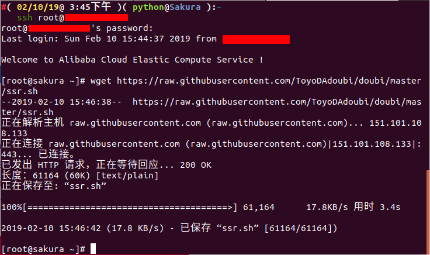

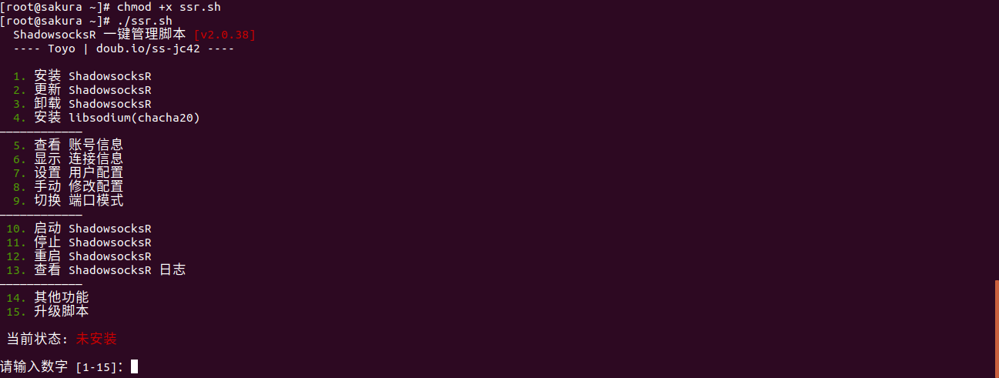

#### 2、安装 ShadowsocksR

输入数字1直接安装 shadowsocksR ，设置下端口号和密码，这里我们指定端口号为65530，密码是1234。

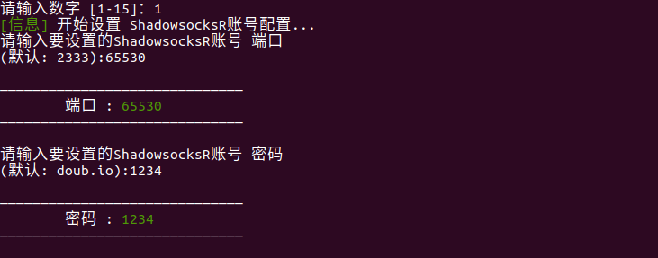

选择加密方式为 aes-256-cfb(根据需求设定)。

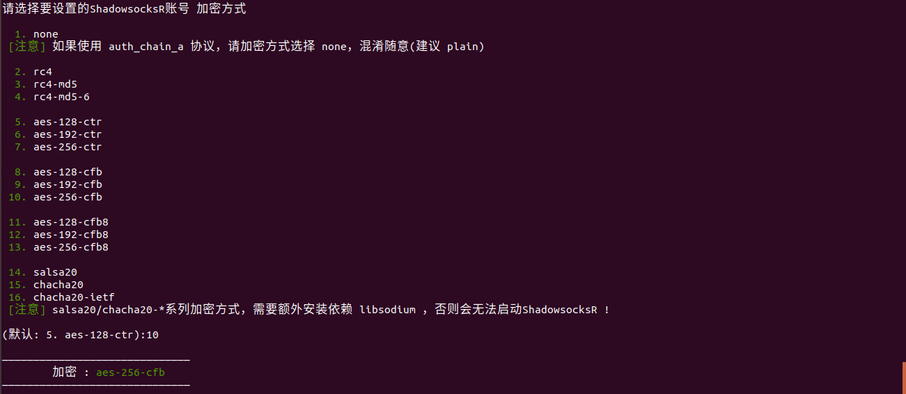

设置协议为 origin (根据需求设定)。

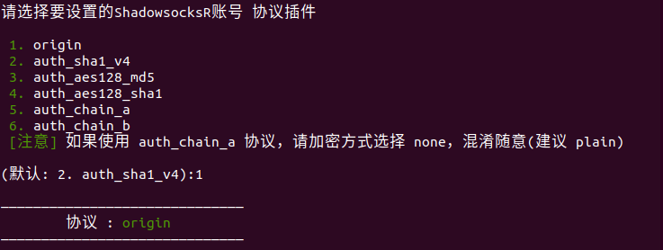

设置混淆插件为 plain (根据需求设定)。

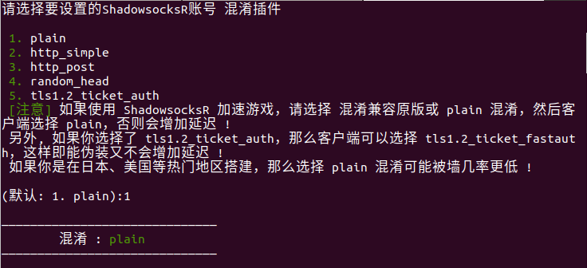

其它选项设置为默认，一路回车即可。(默认是单端口模式，也可以修改成多端口模式)

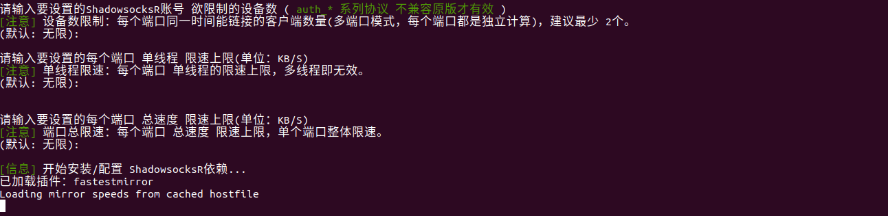

这样就配置成功了，配置成功信息如下：

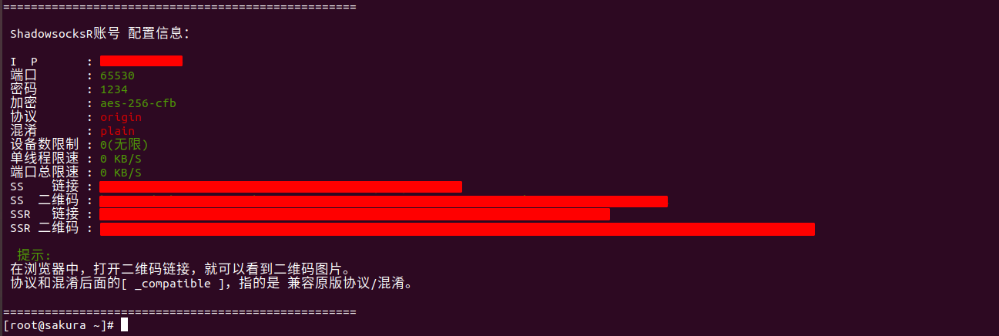

#### 3、启用 Google 的 TCP 加速

```shell
wget https://github.com/teddysun/across/raw/master/bbr.sh
chmod +x bbr.sh
./bbr.sh
```

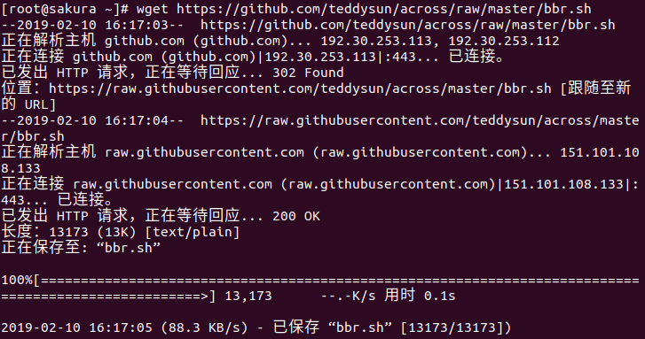

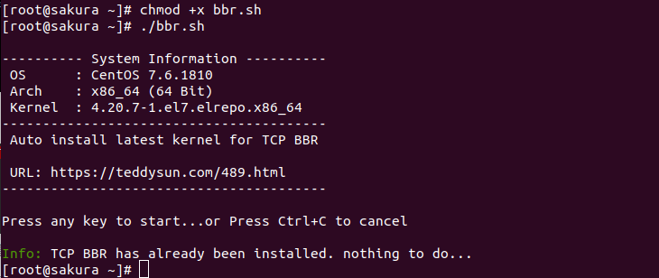

#### 4、验证

```shell
lsmod | grep bbr
```

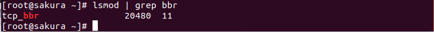

#### 5、设置客户端代理

我们打开客户端，编辑服务器，输入配置信息即可。

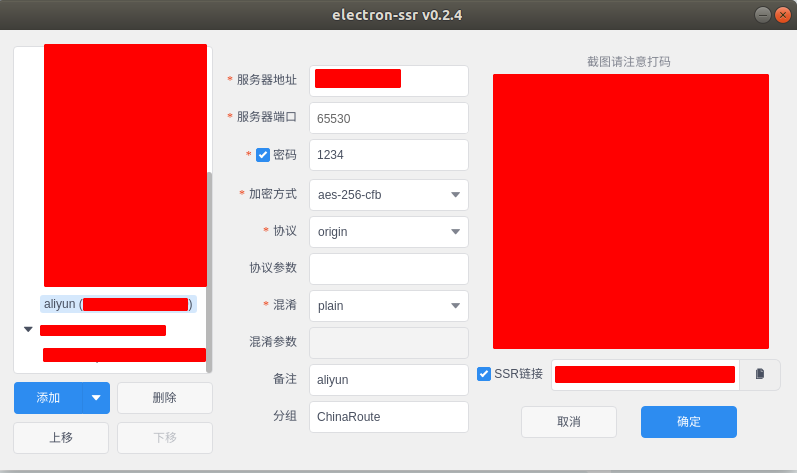